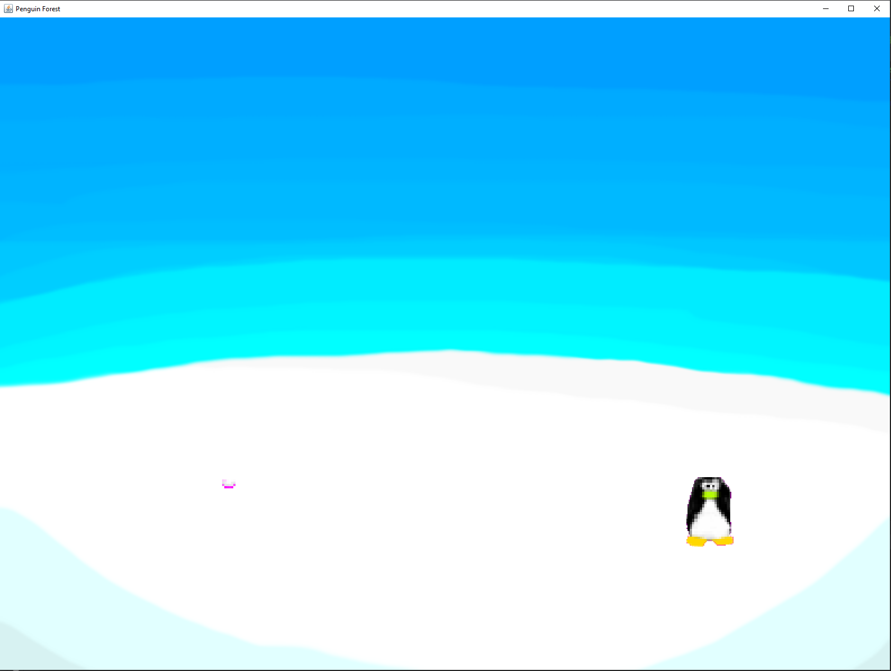

#  `Penguin Forest`
When I was a wee lad my first moment joining club penguin was in the forest to 
grab a rare item. Since then, I had always dreamed wondered how could I make
something like club penguin. So now after a few years of development under my 
belt I thought I would recreate the basic idea from scratch.

### v0.1 - Snowballs and waddling

The most basic idea is there, you can click on snowy parts of the map
and your penguin will walk there with a waddle animation. as well as you can right click on a location
on the level to throw a snowball